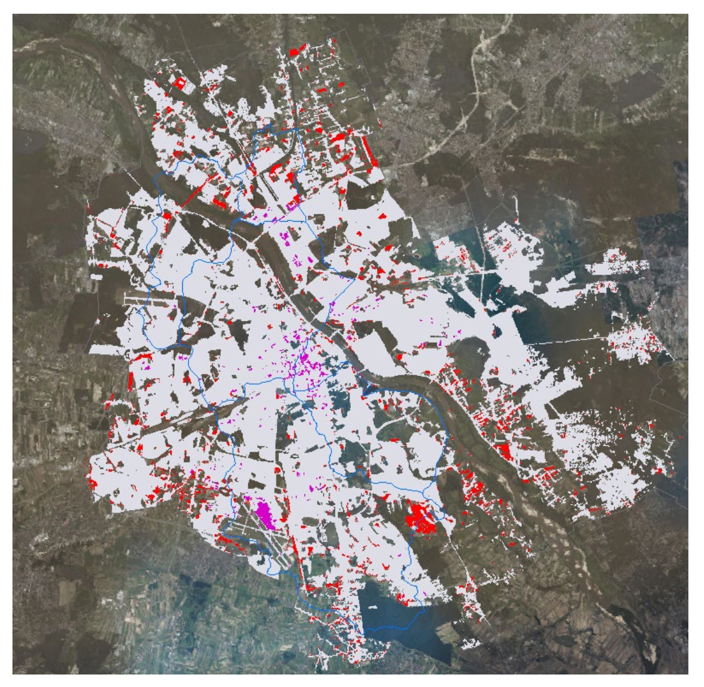

# Week 01: Getting started with remote sensing

## Summary

Remote sensing can be defined as the acquisition of information about the Earth from a distance. To collect Earth observation data, sensors are required, which can be classified as either passive or active. Passive sensors rely on naturally available energy, such as sunlight, and include instruments like the human eye, cameras, and optical satellite sensors. In contrast, active sensors provide their own source of energy for illumination, as seen in systems such as Synthetic Aperture Radar (SAR).

Both types of sensors operate using electromagnetic (EM) waves, which are generated by vibrating charged particles and travel through the vacuum of space at the constant speed of light. EM waves vary in wavelength and frequency: as frequency and energy increase, wavelength decreases. For example, gamma rays have very short wavelengths and high frequencies, whereas radio waves have long wavelengths and low frequencies. Although all EM waves travel at the same speed, only a small portion of the spectrum is visible to the human eye. Objects appear coloured because they absorb certain wavelengths of visible light and reflect others, with the reflected wavelengths determining the observed colour.

Importantly, all materials on Earth emit, absorb, and reflect EM radiation differently. Understanding these interactions allows us to study environmental phenomena such as vegetation dynamics, seasonal change, surface temperature, material composition, and habitat distribution. When EM energy reaches the Earth’s surface, it is partially absorbed and reflected. Before reaching the sensor, the reflected energy may be scattered or absorbed by atmospheric particles. Factors such as scattering, clouds, polarisation, fluorescence, and the Bidirectional Reflectance Distribution Function (BRDF) can significantly influence the recorded signal.

Shorter wavelengths scatter more easily in the atmosphere, explaining why the sky appears blue. Atmospheric scattering can also obstruct surface observations, particularly due to clouds. Active sensors using longer wavelengths can overcome this limitation, as they are capable of penetrating clouds and other atmospheric disturbances.

Remotely sensed data are characterised by four key resolutions: spatial (pixel size), spectral (number of wavelength bands), temporal (revisit frequency), and radiometric (sensitivity to differences in energy). Environmental conditions and sensor limitations often constrain data choice, making it essential to select appropriate data for specific applications.

Wrapping up, remote sensing is a powerful tool, but it has natural and technical limits. The atmosphere is a constant problem because clouds act as a physical barrier and haze can make images look blurry or blue, hiding important details. Physically, most sensors only see the top few millimeters of the Earth, so understanding what is underground requires extra assumptions instead of direct sight. Finally, practical factors like high costs and specific data needs often limit which imagery is used for a project.

## Application

One example of remote sensing application is seen the Kuc, G. and Chormański, J. (2019) study. They used Sentinel-2 satellite data to map "sealed" surfaces like roofs and pavement in Warsaw, Poland. By using the satellite's 10-meter detail and special indices like NDBI, researchers were able to identify where concrete has replaced natural ground. This is very helpful for city water management, as it helps planners predict where rain might cause floods because it cannot soak into the soil. This shows how free satellite data can provide an up-to-date look at how cities are growing and changing.

Image 01: Imperviousness Layer for Warsaw.

```{r}

```

Source: Kuc, G. and Chormański, J. (2019) ‘Sentinel-2 imagery for mapping and monitoring imperviousness in urban areas’, The International Archives of the Photogrammetry, Remote Sensing and Spatial Information Sciences, 42, pp. 43–47.

Another research project looked at Slovakia to find and map green spots like parks, cemeteries, and private gardens. The team used a method called supervised classification, which basically means teaching a computer to recognize different types of vegetation based on how they reflect light. This allowed them to measure how much these green areas help to cool down the city air or provide a place for people to enjoy nature. The study found that even private gardens are important for a city's health and biodiversity (Kopecká, Szatmári and Rosina, 2017).

Image 02: Six processing steps of the UGS extraction and classification (an example from study Bratislava)

```{r}
knitr::include_graphics('img/wk1_f2.png')
```

"(a) A true colour composite produced from S2A data; (b) result of the maximum area Bratislava); (c) binary map of vegetation/non-vegetation land cover; (d) vectorised and visually enhanced polygons with the minimum mapping unit of 500 m2 likelihood supervised automatic classification; (e) result of UGS visual interpretation and polygon editing; (f) tree cover share estimated"

Source: Kopecká, M., Szatmári, D. and Rosina, K. (2017) ‘Analysis of urban green spaces based on Sentinel-2A: Case studies from Slovakia’, Land, 6(2), p. 25.

Comparing these two studies, both rely on the high-quality, free images from Sentinel-2 to solve city problems. The main difference is their goal: the Warsaw study focuses on man-made materials to manage water and floods, while the Slovakian study focuses on nature and plants to improve the local environment and human well-being. Both demonstrate that satellites allow urban monitoring, without having to visit every single street in person. However, both studies indicated methodology gaps that lead to the conclusion that a human expert is still needed to verify and improve result's quality. For example, the Warsaw study used 20 meter resolution bands for their building index (NDBI), which was much blurrier than the 10 meter bands used for the plant index (NDVI), making it harder to find small building due to this resolution mismatch (Kuc & Chormański, 2019). Another example, from Kopecká & all (2017), is that satellites can identify the green spaces, but it couldn't tell the difference between each kind of green space, such as park and cemetery.     

## Reflection

Earth Observation (EO) data have strong potential to support environmental policy because they provide consistent, large-scale information about the Earth’s surface. However, integrating EO data into policy is not always straightforward, due to constraints such as limited technical expertise, challenges in interpreting satellite outputs, and gaps between scientific results and policy needs. One important aspect of EO is that different sensors can be selected according to environmental conditions; for example, radar data are often used in regions with frequent cloud cover where optical imagery is unreliable. This demonstrates that EO can be adapted to real-world problems, but only when its limitations are clearly understood. The increasing availability of free satellite data, such as imagery from the Sentinel and Landsat missions, together with online platforms like Google Earth Engine, has made EO more accessible to governments and organisations with limited technical resources. These tools allow users to analyse a wide range of surface changes, including deforestation, flooding, crop conditions, urban expansion, and ship movements, without the need to process raw data from scratch. As a result, EO-based evidence can inform planning decisions and support a more critical evaluation of policy claims based on spatial data.

## References

MacLachlan, A. CASA0023 Remotely Sensing Cities and Environments: 1 Getting started with remote sensing. Available at: https://andrewmaclachlan.github.io/CASA0023/intro.html (Accessed: 18 January 2026).

Brady, M. (2021) Remote Sensing for Dummies. Available at: https://storymaps.arcgis.com/stories/cb1577b0f5bc485c974b4ea19d52282d (Accessed: 18 January 2026).

Kerle, N., Janssen, L.L.F. and Huurneman, G.C. (eds.) (2004) Principles of Remote Sensing. 3rd edn. Enschede: International Institute for Geo-Information Science and Earth Observation (ITC).

Kopecká, M., Szatmári, D. and Rosina, K. (2017) ‘Analysis of urban green spaces based on Sentinel-2A: Case studies from Slovakia’, Land, 6(2), p. 25.

Kuc, G. and Chormański, J. (2019) ‘Sentinel-2 imagery for mapping and monitoring imperviousness in urban areas’, The International Archives of the Photogrammetry, Remote Sensing and Spatial Information Sciences, 42, pp. 43–47.
