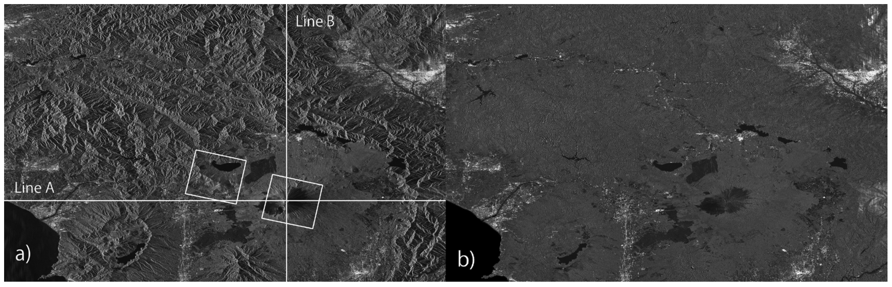
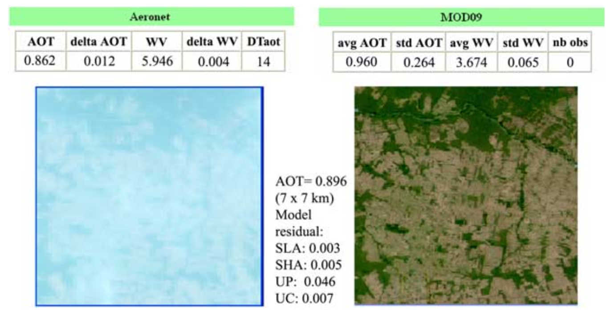

# Week 03: Corrections

## Summary

Satellite images aims to capture the Earth’s surface, but sometimes it can contains flaws that need to be corrected in order to provide better pictures. There are four major types of corrections in remote sensing: geometric, atmospheric, orthorectification/topographic and radiometric.

Geometric correction is needed when image distortion occurs, normally due to view angle, topography, wind or rotation of the Earth. This correction is done by identifying Ground Control Points (GCP) to match known points in the image and a reference dataset. There are many algorithms that try to transform the image coordinates into a actual coordinates, and the model with lower RMSE will fit best.

Atmospheric correction is used when the atmosphere (air, dust, haze, water vapor, etc) in between the sensor and the observed object creates light effects in the picture. Moreover, there are three major types of atmospheric correction: relative, absolute and empirical line correction. First, relative correction adjusts images so they are consistent with each other (reducing differences caused by atmosphere or lighting) without converting to true physical reflectance values. Dark object subtraction (DOS) and Psuedo-invariant Features (PIFs) are examples of relative correction. Absolute correction uses physical models of the atmosphere and sensor to convert measured radiance into real surface reflectance values. And empirical line correction uses known ground targets with measured reflectance (like bright and dark surfaces) to directly calibrate the image to true reflectance.

Orthorectification correction or topographic correction is applied to remove distortions, created by the position of the satellite in relation to the Earth. Additionally, it is done by giving coordinates to the image and creating a nadir view (from strait down). Some methodologies can be used to do this correction, such as cosine correction, Minnaert correction, Statistical Empirical correction and C Correction.

Radiometric calibration is needed because sensor noise, instrument drift, varying illumination conditions, and atmospheric effects can distort the recorded signal, making images from different dates or sensors difficult to compare. Furthermore, this correction fixes how bright or dark satellite images appear so the numbers in the image truly represent how much light is coming from the Earth’s surface. This is done by converting raw image numbers into real light values (radiance and reflectance) and by removing atmospheric effects using simple or physical correction methods.

After analysing if any type of correction is needed, it might be necessary to join different satellite images. Additionally, when joining two satellite images together, they are made to overlap by about 20–30% so their brightness can be compared and adjusted. In the overlap area, a sample of pixels is taken and a brightness histogram from the base image is created, then this histogram is matched to the second image so both images have similar brightness levels. This helps remove visible differences between the images, and finally feathering is applied to smoothly blend the edges so the join looks natural and seamless.

Image enhancement adjusts features, such as brightness, contrast, and sharpness, to highlight some objects in the Earth’s surface (e.g. roads, vegetation, water, or land differences). Moreover, most materials reflect similar amounts of energy in the same wavelengths, and sensors are designed to avoid saturation, so images often use only a small part of the available brightness range. Contrast stretching expands this limited range to use more of the available values, and this can be done using methods such as minimum–maximum stretching, percentage linear stretching, standard deviation stretching, and piecewise linear stretching.

Even though these correction methods are very useful, they have some practical limitations to be considered. One of them is that there is no single way to choose a correction method. Usually, it is needed to test a few different ones on a small part of teh image to see which works best for your specific project. As a consequence, choosing a correction mode can be slow and subjective. Another one is that doing advanced corrections often requires powerful computers and expert technical skills, which reduce the accessibility of those methods. Furthermore, if a correction causes big pixel's change, the results might become hard to explain or disconnected to real-world features.

## Application

One major way to fix errors in satellite data is through geometric and terrain correction, especially for radar images which are often distorted because the sensor looks at the Earth from a side angle. Because of this angle, mountains can look like they are leaning over or create "shadows" where data is missing. A solution for this issue was presented in a study (Shimada, M., 2010) where they used a 3D map of the land, called a Digital Elevation Model (DEM), to simulate what the radar image should look like and then use that simulation to shift the real pixels into their correct spots. Moreover, this approach was tested on data from the ALOS PALSAR satellite (a SAR satellite), and it has been used to keep location errors to about 12 meters even in high mountain areas like Mt. Fuji. Correcting these shifts is essential for making sure that features like forests or buildings appear exactly where they belong on a map.

::: {style="text-align: center;"}
**Image 01: Mt. Fuji geometric correction**

```{r}
#| echo: false


```

"ALOS PALSAR images of Mt. Fuji before (a) and after (b) slope correction (for layover and cross section area)."

**Source**: Shimada, M., 2010. Ortho-rectification and slope correction of SAR data using DEM and its accuracy evaluation. IEEE Journal of Selected Topics in Applied Earth Observations and Remote Sensing, 3(4), pp.657-671.
:::

Another application is atmospheric correction. A study developed by Vermote and Kotchenova (2008) described a system for removing the "blur" caused by gases and tiny particles (aerosols) in the air from optical satellite images. Their approach uses a complex mathematical code called 6SV to simulate how light moves through the atmosphere so they can calculate the true physical reflectance of the Earth's surface. By checking their results against ground sensors from the AERONET network ("a global federation of ground-based, automated sun photometers developed by NASA and LOA-PHOTONS (CNRS) to monitor atmospheric aerosols" \[4\], they found that the corrected data is very good for tracking forest health or land cover. However, they noted that the blue light band is harder to correct because the algorithm uses that same band to estimate how much smoke or dust is in the air, making the results for that specific color less reliable.

::: {style="text-align: center;"}
**Image 02: Application of the smoke low absorption model in Alta Floresta site**

```{r}
#| echo: false


```

"MODIS TOA (left) reflectance and (right) surface reflectance RGB images. The MODIS data were collected over the Alta Floresta AERONET site on 13 September 2003. AOT and WV are the values of aerosol optical thickness and water vapor content (g/cm2) measured by AERONET and retrieved by the MODIS AC algorithm; delta means the measured variability; std means the standard deviation; DTaot designates the difference in time between two AERONET observations which bracket the MODIS acquisition; and nb obs is the number of ‘‘good’’ MODIS observations. SLA, SHA, UP, and UC are abbreviations for smoke low absorption, smoke high absorption, urban polluted, and urban clean aerosol models, respectively. The AERONET site is located in the center of the image."

**Source**: Vermote, E.F. and Kotchenova, S., 2008. Atmospheric correction for the monitoring of land surfaces. Journal of Geophysical Research: Atmospheres, 113(D23).
:::

While both of these examples show how correction improves satellite data, they address different challenges. The first method is an example of fixing physical distortions caused by the shape of the land, which is a major strength for mapping hilly or mountainous areas. Its main limitation, however, is that it requires a highly accurate 3D map of the terrain to work correctly. The second method is an example of fixing clarity and color, providing precise data for monitoring plants and soil on a global scale. Its biggest limitation is the need for specific local weather data, like how much water vapor was in the air at the exact moment the picture was taken—which isn't always available. Together, these studies show that the best correction method depends on whether you are using radar or optical sensors and whether you are studying flat fields or steep mountains. Furthermore, the need of accurate local data for verifying the accuracy of this methods might restrict it's accessibility in a first moment. Conversely, after the methods are validated, it could be a strong tool to study places where local data is missing.

## Reflection

In this week,I learned that pre-processing and applied corrections might be required before satellite images can be used for analysis. In that sense, when receiving a dataset that already have been "corrected", it is important to be critical about its reliability, as the correction methods applied can strongly influence the final results. Overall, learning about the range of correction techniques showed that there is no single best method, and that selecting the most appropriate approach depends on the study context, data type, and research objectives. Regarding my previous work in land subdivision and legal compliance in Brazil, I now recognize that corrections like orthorectification are critical for ensuring features are accurately mapped, which prevents costly errors in planning and licensing.

## References

1- MacLachlan, A. CASA0023 Remotely Sensing Cities and Environments: 3 Corrections. Available at: https://andrewmaclachlan.github.io/CASA0023/3_corrections.html (Accessed: 31 January 2026).

2- Shimada, M., 2010. Ortho-rectification and slope correction of SAR data using DEM and its accuracy evaluation. IEEE Journal of Selected Topics in Applied Earth Observations and Remote Sensing, 3(4), pp.657-671.

3- Vermote, E.F. and Kotchenova, S., 2008. Atmospheric correction for the monitoring of land surfaces. Journal of Geophysical Research: Atmospheres, 113(D23).

4- National Oceanic and Atmospheric Administration (NOAA), Chemical Sciences Laboratory. Platform: AERONET. Available at: https://csl.noaa.gov/projects/firex-aq/groundsites/aeronet.html#:\~:text=The%20program%20was%20established%20by%20NASA%20and,*%20Missoula%20*%20Taylor%20Ranch%20\*%20McCall (Accessed 26 March 2026).
