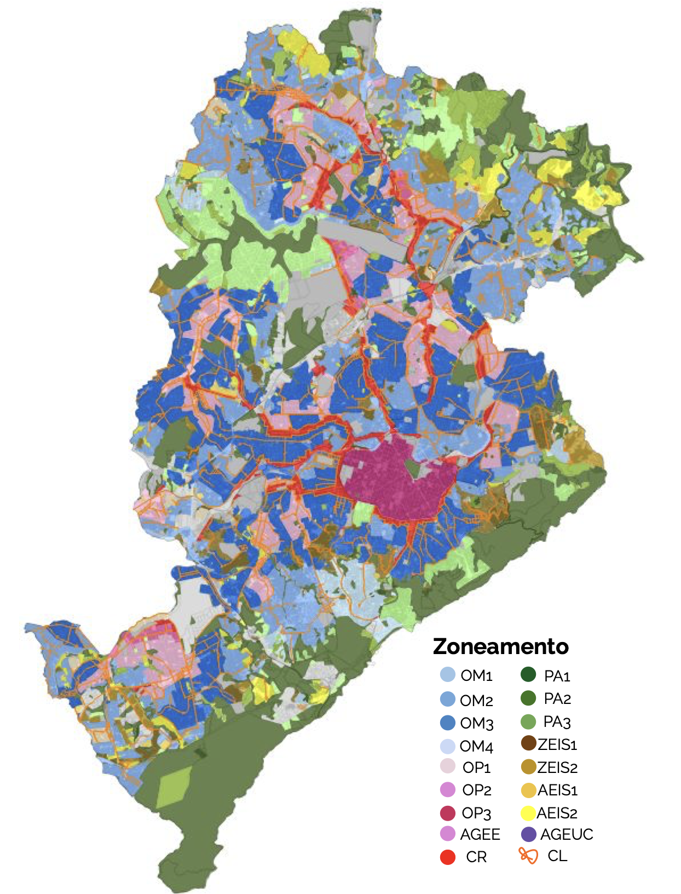

# Week 04: Policy

## Summary

The Belo Horizonte’s Plan, also called ‘Plano Diretor’, was established by Municipal Law 11,181 in 2019. This policy aims to address issues related to urban structure, urban development, environment, housing, cultural and urban heritage, and mobility, as well as the treatment of public and private spaces in Belo Horizonte, capital of the state of Minas Gerais in Brazil. One thing that this plan does is define land use zones for the city, and for each zone there are specific urban parameters to guide land use and urban expansion. Moreover, there are ten types of zones, and among them is the environmental preservation zone, which is subdivided into three levels (PA1, PA2 and PA3), from the most to the least restrictive in terms of land use. 

```{r}

```
Source: Secretaria Municipal de Política Urbana da Prefeitura de Belo Horizonte (2020) E-book Plano Diretor de BH: OCUPAÇÃO DO SOLO". Available at: https://prefeitura.pbh.gov.br/sites/default/files/estrutura-de-governo/politica-urbana/2023/001_zoneamento_0.pdf (Accessed: 22 February 2026).

Environmental preservation zones were established in areas where there are environmental attributes that need to be preserved, such as springs, watercourses, valley bottoms and dense fragments of native vegetation. Finally, the way to ensure that this policy is respected is by requiring a municipal licence to build and clear land in these areas, where the technical staff of the local council assesses whether the parameters established by law are being complied with. However, this mechanism does not cover informal actions, which are currently only identified through complaints and on-site inspections.

## Application 

Considering that Belo Horizonte has an area of over 330,000km² and population of 2,315,560, according to the 2022 Census, the identification of informal land use solely through the methods currently in place is insufficient and/or too costly to cover the entire municipal territory satisfactorily. One way to make this process more efficient is through the application of Earth Observation (EO) to extract and process data from satellites and airborne imagery. This data driven strategy can be used to measure and monitor unsustainable and irregular urban development, providing spatial and temporal scales that are necessary to inform municipalities actions (MacLachlan, Biggs, Roberts, and Boruff, 2021).  

Sentinel-2 would be a good satellite option for monitoring environmental preservation zones in Belo Horizonte, due to its resolution, cost and suitability in this context. Its high-resolution technology (10m resolution for visible and near-infrared bands) is ideal for identifying small clearings or gradual occupation, before large-scale degradation occurs. Additionally, it is open-access imagery with no licensing costs. Moreover, data from Sentinel-2 can be processed by QGIS, which is open source software, and Google Earth Engine, which is free for research and/or the public sector. Furthermore, the revisit time for this satellite is 5 days, ensuring constant monitoring, and it enables temporal comparison from 2015 to the present. Finally, it has 13 spectral bands, including red-edge bands specifically designed for vegetation analysis and supervision of riparian zones and water bodies. 

## Reflection

In addition to aligning with the definitions of the Belo Horizonte’s Plan (municipal scale), the application of Earth Observation for monitoring unsustainable and irregular urban development is in line with the UN Sustainable Development Goals (global scale). Specifically, Goal 11: ‘Make cities and human settlements inclusive, safe, resilient and sustainable’, which advocates for sustainable urbanisation and strengthening efforts to protect the world's natural heritage, respectively in sub-items 11.3 and 11.4. In addition, it is also aligned with Goals 13 and 15, respectively: ‘Take urgent action to combat climate change and its impacts’ and ‘Protect, restore and promote sustainable use of terrestrial ecosystems, sustainably manage forests, combat desertification, and halt and reverse land degradation and halt biodiversity loss’. Overall, it is understood that the use of Sentinel-2 would increase the effectiveness of Belo Horizonte's plan, contributing to the protection of the local environment. However, this technology would also help to monitor unregulated urban sprawl, preventing the formation of new settlements where there is no urban infrastructure (clean water, sewage collection, drainage, public lighting and paving). Overall, remote sensing might be a powerful tool to inform policies in different scales. 

