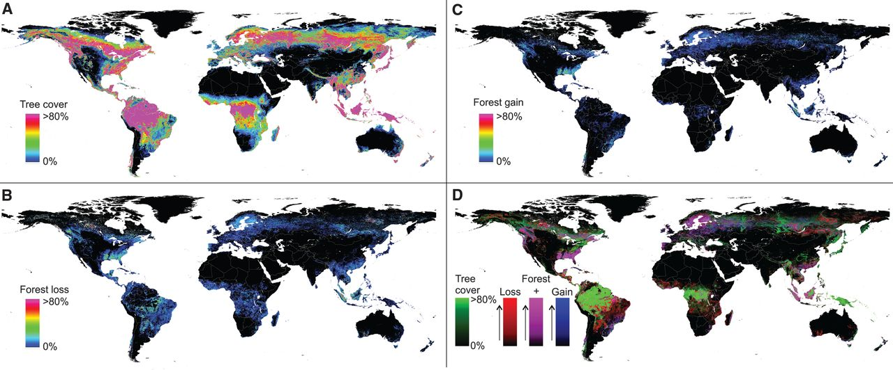
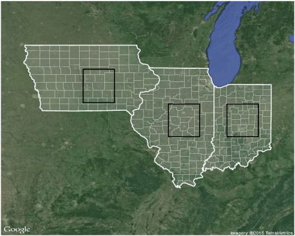

# Week 06: An introduction to Google Earth Engine

## Summary

Google Earth Engine (GEE) is a platform/tool powered by Google’s Data Center Infrastructure to process and analyse geospatial data. Moreover, it’s cloud-service has a great volume of remote sensing data, including Landsat, Sentinel 1 and 2, MODIS, and no-satellite imagery, which allows users to do quickly planetary scale analysis. The data in GEE is organised in object classes, such as Image (raster), ImageCollection, Geometry (vector), Feature (vector with atributes), FeatureCollection, Reducer, Join, Array and Chart. Furthermore, for each kind of class there are specific methods to select and manipulate data. 

Beyond data analysis, this platform enable researchers to do geometry operations, such as joins, zonal statistics filtering, and create artificial intelligence models (machine learning and deep learning) based on the available data. Another GEE’s feature is reducing images, which allows users to create a “summary image” from a ImageCollection (raster’s stack), using the median value for each pixel from the collection. Reduction can be done by region(s), when the reduction occurs for a specific boundary of the study area, and users want to extract a statistic of this place (minimum, mean, maximum, etc). It can also be done by neighbourhood, what means that it will reduce the information in a small window/kernel to a single value for the center pixel. Finally, a different way to reduce images in GEE is using regression. This method allows analysing how values change over time, producing two kinds of images: the intercept (representing the starting value) and the slope (representing the speed or rate of change over time).

## Application 

Google Earth Engine (GEE) is a "game-changer" because it allows planetary-scale analysis that was previously impossible for most researchers. One famous application is the work by Hansen et al. (2013), who mapped global forest change over a decade. By using linear regressions and decision trees on over 600,000 Landsat scenes, they completed a massive processing task in just 100 hours, something that would have taken much more time in a traditional computer. This demonstrates how GEE's ability to “reduce” a large amount of images into maps of "loss" and "gain" provides vital information for biodiversity and climate conservation.

```{r}

```
“(A) Tree cover, (B) forest loss, and (C) forest gain. A color composite of tree cover in green, forest loss in red, forest gain in blue, and forest loss and gain in magenta is shown in (D), with loss and gain enhanced for improved visualization. All map layers have been resampled for display purposes from the 30-m observation scale to a 0.05° geographic grid.”
Source: Hansen et al. (2013)

Beyond forests, GEE is also used in agriculture and urban planning to help achieve global development goals. For instance, Lobell et al. (2015) used GEE to create a scalable crop yield (agricultural production) mapper that processed millions of hectares of maize and soy fields. In urban studies, researchers like Ravanelli et al. (2018) have used GEE to monitor surface urban heat islands. By using reducers to analyse twenty years of temperature data, they were able to show a direct link between urban growth and rising heat levels in major cities. These studies show that GEE's data catalog is a powerful tool for monitoring how earth surface is changing.

```{r}

```
“Overview of the study area in the Midwestern United States. State (thick white lines) and county (thin white lines) boundaries are shown for the three states where yield estimates were made: Iowa, Illinois, and Indiana. Black boxes indicate regions for which detailed comparisons with ground-based yield records were made for 2008–2012.”
Source: Lobell et al. (2015)

```{r}
knitr::include_graphics('img/wk6_f3.png')
```
“Atlanta MA: LC situation in 1992 (a) and in 2011 (b). In red, the Urbanized class, in light green, the Cultivated class, in dark green, the Forest and Shrubland classes.”
Source: Ravanelli et al. (2018)

## Reflection

Google Earth Engine represents the democratization of big data. Before GEE, only elite scientists with expensive supercomputers could handle large amounts of satellite imagery because of technology challenges, such as managing storage and obscure file formats. This platform handles those issues automatically through its cloud-based infrastructure, allowing anyone with an internet connection to perform complex science. Moreover, the concept of reducers is particularly powerful. It enables users to summarise a 30-year stack of data into a regression slope that shows environmental and/or urban trends, which could be very useful in future works. While there are still some challenges, such as "time-out" errors when a task is too complex, GEE changes the focus from the technical struggle of handling data to the creative process of answering research questions.
