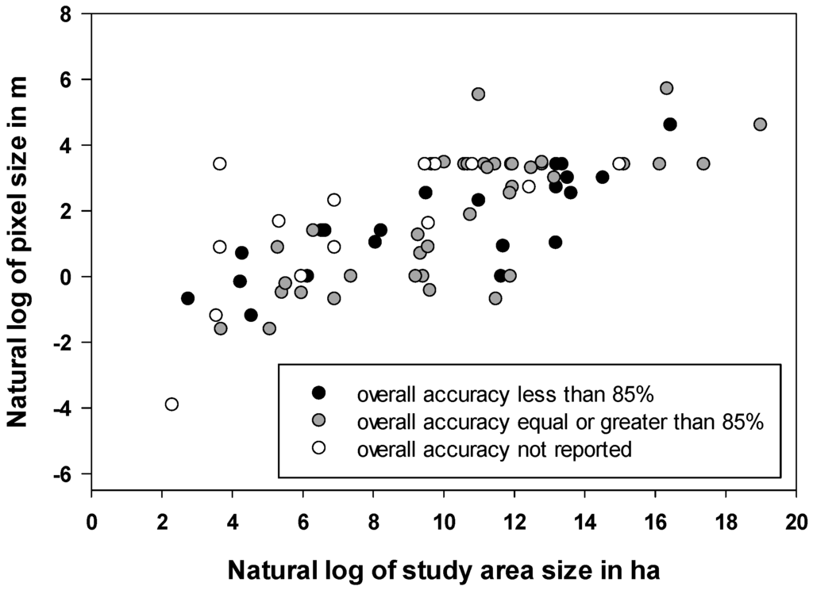

# Week 08: Classification II

## Summary

This week, we moved beyond just looking at individual pixels and explored two smarter ways to classify land. One is sub-pixel analysis. Often, one pixel on a satellite image is a "mix" of different things, like a bit of grass, some water, and a piece of a road all in one 30-meter area, for example. Instead of just picking one label, we use math to find the proportions (like 60% grass and 40% road) inside that single pixel. The other method is Object-Based Image Analysis (OBIA). Instead of looking at pixels, this method groups similar-looking pixels together into bigger shapes called “superpixels”. Using a tool called Simple Non-Iterative Clustering (SNIC), we can make these shapes look like real-world objects, such as a whole park or a building, which makes the map much easier to read.

We also learned how to prove if a map is actually correct using a "check-list" table called a confusion matrix, to check when the model is correct (true positive and true negative), and when the model is incorrect (false positive and false negative). This helps us find two important scores: Producer’s Accuracy (how well the map-maker identified a certain type of land) and User’s Accuracy (how often a person using the map will actually find what the map says is there). An important reflection about accuracy is that spatial autocorrelation might generate map misinterpretation. This means that things close to each other usually look the same. Consequently, while testing a map using spots right next to the ones used to teach the computer, the scores will look much higher than they really are. A solution to achieve honest results is to use spatial cross-validation, which ensures that the model will be tested on areas that are geographically far away from the training areas.

While grouping pixels into objects (OBIA) makes maps look better, it can be a bit subjective because the user has to decide how big or "compact" those shapes should be, resulting in a worse performance when compared to pixel analysis. Moreover, attention should be drawn to the use of Kappa coefficient for checking model accuracy. It used to be a popular method, however it has a confusing interpretation and might give misleading scores. In contrast, the use of tools like the F1 score, is recommended which gives a more balanced and honest look at whether the map is actually correct.

## Application

Regarding the application of these classification methods, a research compared 73 different studies that used OBIA to identify wetlands (Dronova, I., 2015). Moreover, these articles advocate that grouping pixels into shapes helps map complex areas where land and water meet. By treating clusters of pixels as meaningful objects, this approach cleans up the "messy" or "salt-and-pepper" look often found in traditional maps. Instead of relying only on colour, the method uses the size, shape, and the neighbours of these objects to identify structures, such as ponds or marsh patches. This has proven to be a highly effective way to identify specific wetland parts because it works with real-world units rather than just arbitrary grid squares.

::: {style="text-align: center;"}
**Image 01: Spatial scale of the reviewed papers**

```{r}
#| echo: false


```
“Figure 1. Spatial scale of the reviewed papers: significant positive correlation between log-transformed study area size and spatial resolution (R2 = 0.61, p-value \< 0.001).”

**Source**:  Dronova, I., 2015. Object-based image analysis in wetland research: A review. Remote Sensing, 7(5), pp.6380-6413.
:::

In contrast, a study on Mediterranean wetlands shows the power of sub-pixel analysis by looking inside individual map squares to see their true composition (Reschke, J. and Hüttich, C., 2014). Since these environments are constantly shifting, drying up in the summer or flooding in the winter, simply labelling a square as "water" or "land" is inefficient. Instead, math is used to calculate the exact percentage of water, plants, or soil within every single 30-meter square. This "wetland likeliness" approach provides a much more detailed and continuous picture of how the environment shrinks and grows throughout the seasons.

Both approaches attempt to solve the challenge of "fuzzy" boundaries where different types of land blend together. The review of object-based methods shows how grouping pixels into superpixels creates maps that are easier for managers to read as distinct landscape units (Dronova, I., 2015). Meanwhile, the Mediterranean study proves that focusing on the proportions inside each square is better for tracking slow, gradual changes and the specific percentage of each material present (Reschke, J. and Hüttich, C., 2014). While one method helps the user see the bigger objects clearly, the other ensures that fine details are not lost within the "mixels" of a pixelated image.

## Reflection

This week's focus on accuracy and objects would be applicable to my previous work in urban feasibility studies and environmental licensing, once precise technical analysis of land subdivisions are required to ensure compliance with urban legislation. By segmenting satellite imagery into objects that mimic cadastral parcels, Object-Based Image Analysis (OBIA) could have been used to automate the initial identification of illegal land subdivisions or monitored the growth of developments into protected environmental zones with much higher reliability than manual inspections. Additionally, learning that a very high accuracy score might be a consequence of training and testing on the same land parcel (spatial dependence) is a critical lesson, valuable for future works in industry or academia. In the future, I intend to use spatial cross-validation to ensure that any urban models I develop for sustainable growth monitoring are robust enough to work across different neighbourhoods of a city, rather than just overfitting to a specific local context.

## References

**Authorship statement:**I declare that the work in this assessment is my own work and I acknowledge the use of Google NotebookLM (version Standard (free), Google, https://notebooklm.google/) to initial searches, proof reading and grammar correction.

MacLachlan, A. CASA0023 Remotely Sensing Cities and Environments: 7 Classification II. Available at:https://andrewmaclachlan.github.io/CASA0023/7_classification_II.html (Accessed: 20 March 2026).

Dronova, I., 2015. Object-based image analysis in wetland research: A review. Remote Sensing, 7(5), pp.6380-6413.

Reschke, J. and Hüttich, C., 2014. Continuous field mapping of Mediterranean wetlands using sub-pixel spectral signatures and multi-temporal Landsat data. International Journal of Applied Earth Observation and Geoinformation, 28, pp.220-229.
