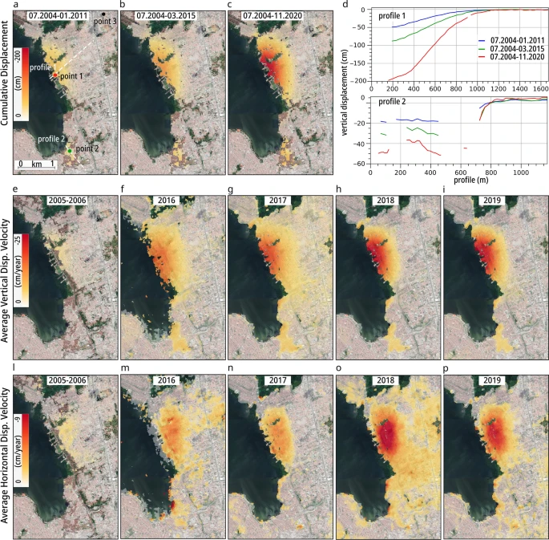
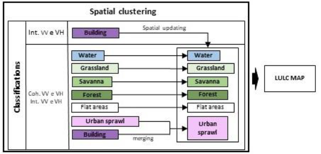

# Week 09: Synthetic Aperture Radar (SAR) data

## Summary

Synthetic Aperture Radar (SAR) is an active sensor that works similarly to a bat; it sends out its own microwave signals and listens for the "backscatter" reflection from the Earth. Unlike regular cameras, SAR sees through clouds, smoke, and total darkness. Each SAR signal provides two types of data: amplitude (the brightness of the reflection) and phase (the specific timing of the wave’s return).

By combining two or more SAR images, a method called Interferometry (InSAR) can map ground movement or surface height. If a Digital Elevation Model (DEM) is used to remove the effect of hills and mountains to focus strictly on land sinking or rising over time, it is known as Differential InSAR (DInSAR).

Selecting the right data depends on the environment. Polarisation refers to the direction of the radar wave (Horizontal or Vertical). For urban areas, HH (Horizontal-Horizontal) is ideal because it creates a "double-bounce" effect off building walls, while VV (Vertical-Vertical) is better for detecting surface roughness on bare ground. SAR data values are stored on different scales: power scale is best for statistics, amplitude is standard for looking at images, and the dB scale is best for finding differences in dark pixels, such as water, which usually reflects radar signals away from the sensor.

To identify changes, simple subtraction doesn't work well because SAR images are naturally "grainy". Instead, researchers use ratio images (dividing one image by another) or a pixelwise t-test, which calculates a signal-to-noise ratio to separate real damage from normal city "noise". In the class study of the 2020 Beirut explosion, this method predicted 9,256 damaged buildings, which was very close to the official UN estimate of 10,000.

Reflections and critiques of these methods show that SAR is essentially a two-dimensional tool trying to solve a three-dimensional problem. Because satellites look down from above, they often underestimate damage on the vertical sides of tall buildings, such as blown-out windows that aren't visible from the top. To fix this, analysts can use 3D models from Open Street Maps (OSM) to simulate how blast waves actually hit building facades.

## Application

A interesting application of SAR was presented in a study developed in Maceió, Brazil. Furthermore, researchers used SAR time-series data to identify where the ground had been slowly sinking for over ten years (Vassileva et al., 2021). By analysing data from 2004 to 2020, they found that areas near salt mines had dropped by as much as 200 cm, causing buildings to crack and forcing the people who lived their to move. This study proves that SAR can detect significant small movements that eventually lead to major urban issues.

::: {style="text-align: center;"}
**Image 01: Maceió’s spatio-temporal evolution of subsidence**

```{r}
#| echo: false


```
“InSAR time series results. (a–c) Cumulative vertical subsidence maps obtained by projecting the LOS component into vertical only and combining in time and space all available displacement datasets. Red, green, and black points show the locations of the time series plotted in Fig.6 respectively point 1 (in the main subsiding area), point 2 (in the minor subsiding area) and point 3 (in hypothetically stable area). White-lines show profile 1 and 2 plotted in (d) where the blue line refers to the period 07.2004–01.2011, green for 07.2004–03.2015, and red for 07.2004–11.2020. Ascending and descending displacements have been combined for the periods where both geometries were available to retrieve (e–i) vertical and (l–p) horizontal average displacement velocities. The horizontal negative values refer to westward motion. Background Google Earth CNES/Airbusimagery. The figures (except d) were plotted in QGIS (v. 3.16, https://www.qgis.org/en/site/)."

**Source**:  Vassileva, M., Al-Halbouni, D., Motagh, M., Walter, T.R., Dahm, T. and Wetzel, H.U. (2021) ‘A decade-long silent ground subsidence hazard culminating in a metropolitan disaster in Maceió, Brazil’, Scientific Reports, 11(1), 7704.
:::

Another study in the Distrito Federal, Brazil, used SAR for Land Use and Land Cover (LULC) mapping (Barbosa et al., 2021). In order to do that, they mixed radar intensity with "interferometric coherence" (a measure of how similar the wave phases stay over time). Moreover, the researchers were able to accurately distinguish between types of vegetation and urban buildings. And, as a consequence, they could monitor urban sprawl in tropical regions where heavy rain and clouds often block traditional optical satellites.

::: {style="text-align: center;"}
**Image 02: Flowchart of LULC map consolidation**

```{r}
#| echo: false


```

**Source**: Barbosa, F.L.R., Guimarães, R.F., Carvalho Junior, O.A. and Gomes, R.A.T. (2021) ‘Land Use/Land Cover (LULC) classification based on SAR/Sentinel 1 image in Distrito Federal, Brazil’, Sociedade & Natureza, 33, e55954.
:::

Comparing these two examples it is possible to notice the flexibility of SAR, and how it can be applied in different contexts. While the Maceió study uses radar phase shifts to catch geological sinking over time (Vassileva et al., 2021), the Distrito Federal research uses SAR to tell the difference between city growth and nature (Barbosa et al., 2021). Both demonstrate that SAR is a good tool for long-term monitoring in Brazil’s humid climate, where being able to "see" through clouds is essential for city planning. However, SAR also leads to some challenges. The Maceió study explains that these satellites only measure movement along a specific "Line-of-Sight," which requires complex math to figure out how much the ground is actually sinking vertically (Vassileva et al., 2021). Similarly, the Distrito Federal study points out that SAR images have a grainy "speckle effect" that can be mistaken for real changes on the ground, as well as "geometric distortions" like layover, where tall buildings appear to lean over other features (Barbosa et al., 2021). Moreover, there is also the problem of "spectral confusion," where different things like flat roads and calm water reflect the signal the same way, making them hard to distinguish (Barbosa et al., 2021).

## Reflection

Learning about Synthetic Aperture Radar (SAR) shows how this "bat-like" sensor can be a powerful tool for urban planners because it sees through clouds and darkness to monitor city changes. Using techniques like InSAR and DInSAR, it is possible to track minimal ground movements or height changes. For someone with my background in urban design and city hall management, these tools provide a reliable way to oversee land subdivision and check that new constructions follows environmental laws, especially when tropical weather blocks normal satellite views. In my future work, I could use SAR to conduct better feasibility studies for urban projects and ensure city growth remains orderly and sustainable by catching illegal building or environmental damage as it happens.

## References

**Authorship statement:**I declare that the work in this assessment is my own work and I acknowledge the use of Google NotebookLM (version Standard (free), Google, https://notebooklm.google/) to initial searches, proof reading and grammar correction.

MacLachlan, A. CASA0023 Remotely Sensing Cities and Environments: 9: Synthetic Aperture Radar (SAR) data’. Available at:https://andrewmaclachlan.github.io/CASA0023/9_SAR.html (Accessed: 22 March 2026).

Ballinger, O. Remote Sensing for OSINT: ‘Blast Damage Assessment’. Case Study 10. Available: https://bellingcat.github.io/RS4OSINT/C3_Blast.html (Accessed: 22 March 2026).

Vassileva, M., Al-Halbouni, D., Motagh, M., Walter, T.R., Dahm, T. and Wetzel, H.U. (2021) ‘A decade-long silent ground subsidence hazard culminating in a metropolitan disaster in Maceió, Brazil’, Scientific Reports, 11(1), 7704.

Barbosa, F.L.R., Guimarães, R.F., Carvalho Junior, O.A. and Gomes, R.A.T. (2021) ‘Land Use/Land Cover (LULC) classification based on SAR/Sentinel 1 image in Distrito Federal, Brazil’, Sociedade & Natureza, 33, e55954.
